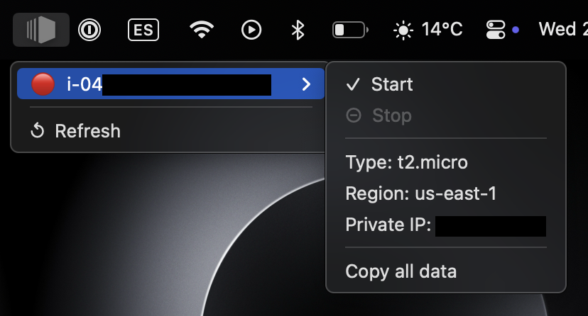
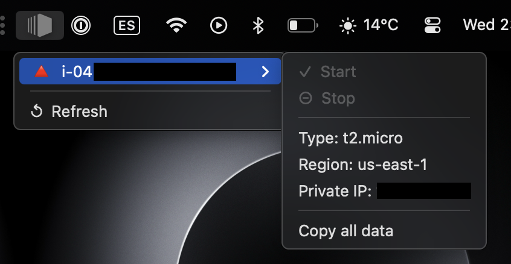
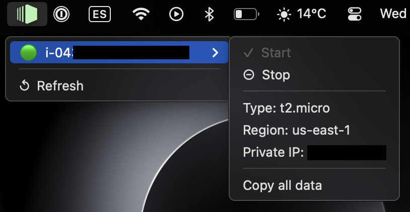

# AWS EC2's status widget [WIP]
An MacOS top bar widget to easily see and control your EC2 instances.


## Functionalities

- Display green icon if any EC2 is running
- Display EC2 status for every instance in specified regions (config file)
- Stop / Start instance
- Quick data copy to clipboard


## In progress
- Configure app via gui


## Disclaimer
App handles AWS auth by setting a profile. It's up to you to set proper permissions. 

User or role must have read only permissions plus:

```json
{
	"Version": "2012-10-17",
	"Statement": [
		{
			"Effect": "Allow",
			"Action": [
				"ec2:StartInstances",
				"ec2:StopInstances"
			],
			"Resource": "*"
		}
	]
}
```

## Display





