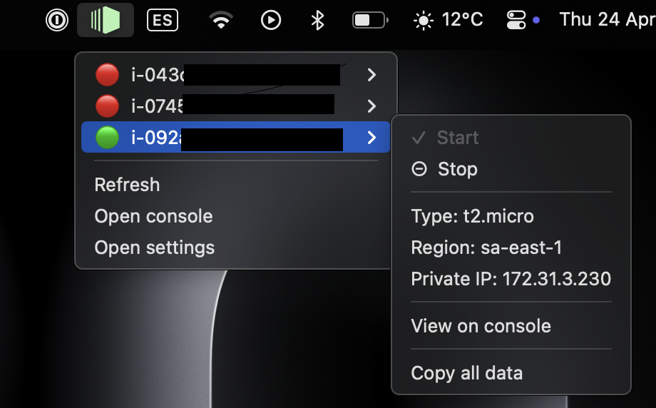
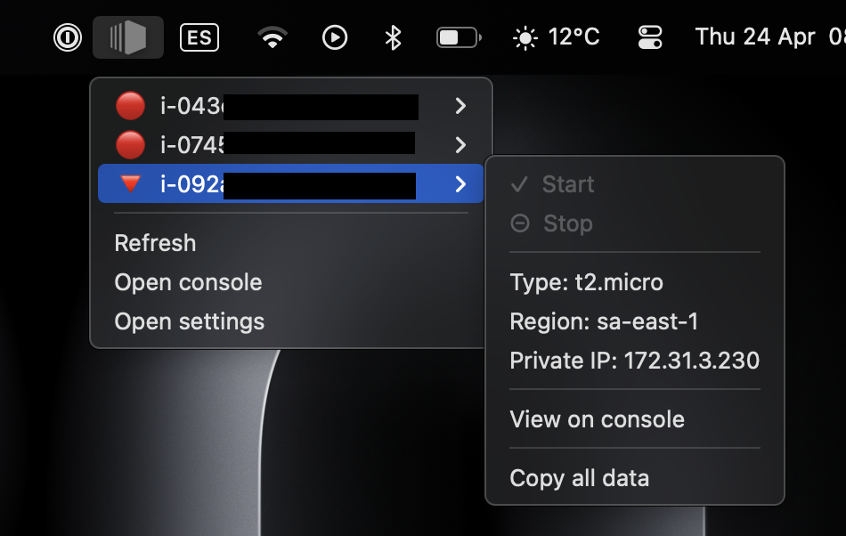

# EC2app 

EC2app is a MacOS top bar widget that lets you quickly detect you EC2 states and control them.


## Functionalities

- Display green icon if any EC2 is running


- Display EC2 status for every instance in specified regions
- Stop / Start instances

- Copy instance full description to clipboard
- Go to instance's page on aws console
- Automatic refresh. (Or force refresh)


## Setup
The app requires an IAM user with permisions to fetch EC2 data. A recommended way to achieve this is:
- Create an IAM user 
- Attach a policy equivalent to [this policy](./setup/policy.json) (RO + start/stop privileges over EC2).
- Create key pair
- Add key pair as in [credentials block](./setup/credentials) to your ~/.aws/credentials file
- Copy [default_config.json](./EC2Status.app/Contents/config/defaults_config.json) to ~/.ec2app/config.json and edit _aws_profile_ field with same value in previous step. (Config file can also be accessed from app menu)


## Installation
To install app ensure your python environment satisfies [requirements.txt](./setup/requirements.txt) or create a new virtual env and reference it on [EC2Status executable path](EC2Status.app/Contents/MacOS/EC2Status)

Recomended steps:

- Make virtual environment
```sh
python3 -m venv ./EC2Status.app/Contents/MacOS/venv
source ./EC2Status.app/Contents/MacOS/venv/bin/activate
pip3 install -r setup/requirements.txt
```


- Try app on terminal
```bash
./EC2Status.app/Contents/MacOS/EC2Status
```

- Or load app
```bash
open EC2Status.app
```

Note: If you are considering installing an EC2 app you most probably know your way around any possible bug. Have fun!

# Collaboration
Feel free to contact me for new ideas.